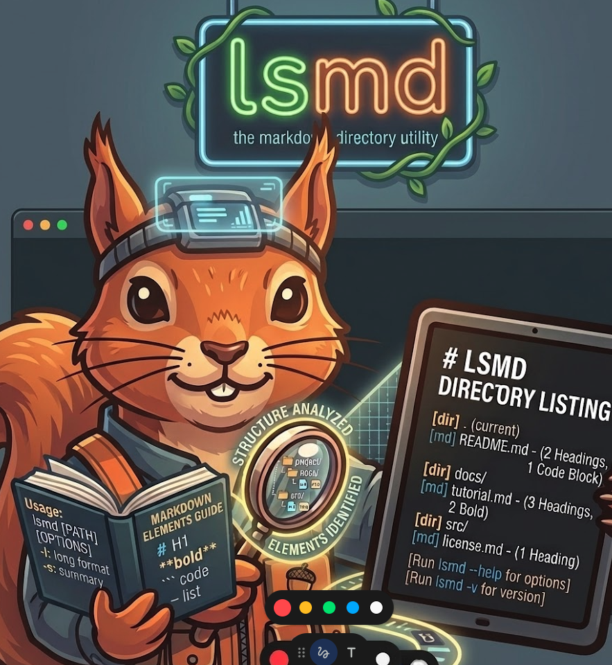

<p align="center">
  
</p>

# lsmd — **L**ist **M**ark**d**own

[](https://github.com/leaf-kit/ls.md/releases/latest)
[](LICENSE)
[](https://www.rust-lang.org/)
[](https://github.com/leaf-kit/homebrew-lsmd)
[](https://github.com/leaf-kit/homebrew-lsmd)

A markdown-aware directory listing tool for the terminal.

> **v0.1.0 Released** — [GitHub Release](https://github.com/leaf-kit/ls.md/releases/tag/v0.1.0) | [Homebrew Tap](https://github.com/leaf-kit/homebrew-lsmd)
>
> ```bash
> brew tap leaf-kit/lsmd && brew install lsmd
> ```

**lsmd** is like `ls`, but it understands Markdown. It parses YAML frontmatter, extracts headings from `.md` files, previews `.txt` first lines, and shows colored tag badges — all inline with the file listing. Directories get a 📂 icon in blue, tags get hash-based color badges, and `.txt` previews are dimmed for clean readability.

A must-have terminal tool for anyone working with Markdown-heavy projects — documentation writers, knowledge base managers, and developers who live in the terminal.

## Why "lsmd"?

**lsmd** stands for **List Markdown**. Just like `ls` lists files, **lsmd** lists files — but with Markdown intelligence. It knows the difference between a file with frontmatter, a file with just an H1 heading, and a plain text file. See metadata at a glance, not after opening.

> *Don't just list files. List meaning.*

## Features

- **YAML frontmatter parsing** — show title, date, and tags inline
- **Tag color badges** — hash-based consistent coloring per tag
- **H1 heading fallback** — when no frontmatter, show the first heading
- **`.txt` first-line preview** — dimmed, truncated at 60 chars
- **Clean output** — 📂 icon for directories only, no emoji clutter on files
- **Directory-first sorting** — directories always listed first, in blue
- **Hidden file support** — `-a` flag to show dotfiles
- **Long format** — `-l` for size, modification time, and metadata
- **Markdown-only filter** — `-m` to show only `.md` and `.txt` files
- **Sorting options** — by name, size, modified time, or type
- **Reverse sort** — `-r` flag
- **Auto color detection** — disables ANSI in non-TTY (pipe-safe)
- **`--no-color` flag** — explicit color disable
- Fast startup — written in Rust, optimized with LTO

## Installation

### Homebrew (macOS)

```bash
brew tap leaf-kit/lsmd
brew install lsmd
```

### Build from Source

```bash
git clone https://github.com/leaf-kit/ls.md.git
cd ls.md
cargo build --release
cp target/release/lsmd /usr/local/bin/
```

Or use the interactive build script (runs tests before release):

```bash
./build.sh
```

The build script provides a menu with options for debug/release builds, local install, tests, clippy, packaging, and Homebrew deployment.

## Update

### Homebrew

```bash
brew upgrade lsmd
```

### From Source

```bash
git pull origin main
cargo build --release
cp target/release/lsmd /usr/local/bin/
```

## Uninstall

### Homebrew

```bash
brew uninstall lsmd
brew untap leaf-kit/lsmd
```

### Manual (source install)

```bash
rm /usr/local/bin/lsmd
```

## Playground

The repository includes a `playground/` directory with sample files for testing every feature. It contains mixed file types, edge cases, and a curated `best-practices/` subdirectory showcasing rich frontmatter with tags.

```bash
git clone https://github.com/leaf-kit/ls.md.git
cd ls.md
cargo build --release
./target/release/lsmd playground
./target/release/lsmd playground/best-practices
```

### Playground Structure

```
playground/
├── best-practices/          # Curated examples with rich frontmatter & tags
│   ├── api-design.md        # tags: api, rest, design
│   ├── cli-ux-tips.md       # tags: cli, ux, design
│   ├── git-workflow.md      # tags: git, workflow, collaboration
│   ├── markdown-style.md    # tags: markdown, writing, documentation
│   ├── project-kickoff.md   # tags: project, checklist, onboarding
│   ├── rust-error-handling.md # tags: rust, error-handling, patterns
│   ├── debugging-checklist.txt
│   └── quick-reference.txt
├── docs/
│   └── guide.md
├── blog-post.md             # Frontmatter with title + date + tags
├── meeting-notes.md          # Frontmatter with title + date + tags
├── no-frontmatter.md         # H1 heading only (fallback test)
├── broken-yaml.md            # Broken YAML (silent error test)
├── empty.md                  # Empty file (edge case)
├── notes.txt                 # .txt first-line preview
├── long-line.txt             # .txt truncation test (>60 chars)
├── empty.txt                 # Empty .txt (edge case)
├── app.py                    # Non-markdown file
├── config.yaml               # Non-markdown file
└── sample.json               # Non-markdown file
```

## Usage

```
% lsmd
lsmd — the markdown directory utility

List directory contents with inline metadata for .md and .txt files.
Like ls, but understands Markdown frontmatter, headings, and text previews.

Get started with `lsmd` to see the current directory,
or `lsmd -l` for detailed output with metadata summaries.

Usage: lsmd [OPTIONS] [PATH]

Arguments:
  [PATH]
          Directory to list (default: current directory)

          [default: .]

Options:
  -a, --all
          Show hidden files (dotfiles)

  -l, --long
          Long listing format with metadata details

      --no-color
          Disable colored output

  -s, --sort <SORT_BY>
          Sort by: name (default), size, modified, type

          [default: name]

  -r, --reverse
          Reverse sort order

  -m, --md-only
          Show only .md and .txt files

  -h, --help
          Print help (see a summary with '-h')

  -V, --version
          Print version

Discussion:
    lsmd is your markdown companion for navigating directories
    with rich document context. It parses YAML frontmatter,
    extracts headings, previews text files, and displays
    colored tag badges — all inline with the listing.

    Get started with `lsmd` to see the current directory,
    or `lsmd -l` for detailed metadata view.
```

## Commands & Output Examples

All examples below are actual outputs from running `lsmd` against the included `playground/` directory.

### 1. Default Listing

```
% lsmd playground
📂 best-practices/
📂 docs/
  app.py
  blog-post.md  Getting Started with Rust · 2026-03-15 ·  rust   programming   tutorial
  broken-yaml.md
  config.yaml
  empty.md
  empty.txt
  long-line.txt  This is a very long first line that should be truncated wit…
  meeting-notes.md  Team Meeting Notes · 2026-04-01 ·  meeting   planning
  no-frontmatter.md  Simple Document
  notes.txt  Quick notes from today's brainstorming session about the ne…
  sample.json
```

Key behaviors:
- **Directories** listed first with 📂 icon (`best-practices/`, `docs/`)
- **Files** listed without emoji, clean indentation
- **`.md` with frontmatter** shows title · date · tag badges (`blog-post.md`)
- **`.md` without frontmatter** shows H1 heading (`no-frontmatter.md`)
- **`.md` with broken YAML** silently ignored (`broken-yaml.md`)
- **`.md` empty file** no extra info (`empty.md`)
- **`.txt` files** show dimmed first-line preview, truncated at 60 chars
- **Other files** listed plainly without icons

### 2. Long Format (`-l`)

```
% lsmd playground -l
📂 320 B  2026-04-05 02:09  best-practices/
📂  96 B  2026-04-05 01:22  docs/
  152 B  2026-04-05 01:21  app.py
  487 B  2026-04-05 01:21  blog-post.md  Getting Started with Rust · 2026-03-15 ·  rust   programming   tutorial
  191 B  2026-04-05 01:22  broken-yaml.md
   56 B  2026-04-05 01:22  config.yaml
    0 B  2026-04-05 01:21  empty.md
    0 B  2026-04-05 01:21  empty.txt
  180 B  2026-04-05 01:21  long-line.txt  This is a very long first line that should be truncated wit…
  395 B  2026-04-05 01:21  meeting-notes.md  Team Meeting Notes · 2026-04-01 ·  meeting   planning
  187 B  2026-04-05 01:21  no-frontmatter.md  Simple Document
  190 B  2026-04-05 01:21  notes.txt  Quick notes from today's brainstorming session about the ne…
   43 B  2026-04-05 01:21  sample.json
```

Shows file size and modification time alongside metadata.

### 3. Show Hidden Files (`-a`)

```
% lsmd playground -a
📂 .hidden-dir/
📂 best-practices/
📂 docs/
  .hidden-file.md  Hidden Markdown File
  app.py
  blog-post.md  Getting Started with Rust · 2026-03-15 ·  rust   programming   tutorial
  broken-yaml.md
  ...
```

Reveals dotfiles and hidden directories.

### 4. Markdown Only (`-m`)

```
% lsmd playground -m
📂 best-practices/
📂 docs/
  blog-post.md  Getting Started with Rust · 2026-03-15 ·  rust   programming   tutorial
  broken-yaml.md
  empty.md
  empty.txt
  long-line.txt  This is a very long first line that should be truncated wit…
  meeting-notes.md  Team Meeting Notes · 2026-04-01 ·  meeting   planning
  no-frontmatter.md  Simple Document
  notes.txt  Quick notes from today's brainstorming session about the ne…
```

Filters to show only `.md` and `.txt` files (directories are always included).

### 5. Sort Options

**Sort by size:**
```
% lsmd playground -s size
📂 docs/
📂 best-practices/
  empty.txt
  empty.md
  sample.json
  config.yaml
  app.py
  long-line.txt  This is a very long first line that should be truncated wit…
  no-frontmatter.md  Simple Document
  notes.txt  Quick notes from today's brainstorming session about the ne…
  broken-yaml.md
  meeting-notes.md  Team Meeting Notes · 2026-04-01 ·  meeting   planning
  blog-post.md  Getting Started with Rust · 2026-03-15 ·  rust   programming   tutorial
```

**Sort by name, reversed:**
```
% lsmd playground -s name -r
📂 docs/
📂 best-practices/
  sample.json
  notes.txt  Quick notes from today's brainstorming session about the ne…
  no-frontmatter.md  Simple Document
  meeting-notes.md  Team Meeting Notes · 2026-04-01 ·  meeting   planning
  long-line.txt  This is a very long first line that should be truncated wit…
  empty.txt
  empty.md
  config.yaml
  broken-yaml.md
  blog-post.md  Getting Started with Rust · 2026-03-15 ·  rust   programming   tutorial
  app.py
```

### 6. Best Practices — Curated Examples

The `playground/best-practices/` directory contains well-structured Markdown documents with rich frontmatter, demonstrating how lsmd displays titles, dates, and colored tag badges at a glance.

**Default listing:**
```
% lsmd playground/best-practices
  api-design.md  RESTful API Design Principles · 2026-03-15 ·  api   rest   design
  cli-ux-tips.md  CLI UX Design Tips · 2026-04-03 ·  cli   ux   design
  debugging-checklist.txt  Step-by-step debugging checklist for production incidents
  git-workflow.md  Git Workflow Guide · 2026-03-20 ·  git   workflow   collaboration
  markdown-style.md  Markdown Writing Style Guide · 2026-03-10 ·  markdown   writing   documentation
  project-kickoff.md  Project Kickoff Checklist · 2026-04-01 ·  project   checklist   onboarding
  quick-reference.txt  Common terminal shortcuts and commands for daily developmen…
  rust-error-handling.md  Rust Error Handling Patterns · 2026-03-28 ·  rust   error-handling   patterns
```

**Long format:**
```
% lsmd playground/best-practices -l
  744 B  2026-04-05 02:08  api-design.md  RESTful API Design Principles · 2026-03-15 ·  api   rest   design
  773 B  2026-04-05 02:09  cli-ux-tips.md  CLI UX Design Tips · 2026-04-03 ·  cli   ux   design
  403 B  2026-04-05 02:09  debugging-checklist.txt  Step-by-step debugging checklist for production incidents
  697 B  2026-04-05 02:08  git-workflow.md  Git Workflow Guide · 2026-03-20 ·  git   workflow   collaboration
  737 B  2026-04-05 02:09  markdown-style.md  Markdown Writing Style Guide · 2026-03-10 ·  markdown   writing   documentation
  532 B  2026-04-05 02:08  project-kickoff.md  Project Kickoff Checklist · 2026-04-01 ·  project   checklist   onboarding
  381 B  2026-04-05 02:09  quick-reference.txt  Common terminal shortcuts and commands for daily developmen…
  836 B  2026-04-05 02:08  rust-error-handling.md  Rust Error Handling Patterns · 2026-03-28 ·  rust   error-handling   patterns
```

**Markdown only (`-m`):**
```
% lsmd playground/best-practices -m
  api-design.md  RESTful API Design Principles · 2026-03-15 ·  api   rest   design
  cli-ux-tips.md  CLI UX Design Tips · 2026-04-03 ·  cli   ux   design
  debugging-checklist.txt  Step-by-step debugging checklist for production incidents
  git-workflow.md  Git Workflow Guide · 2026-03-20 ·  git   workflow   collaboration
  markdown-style.md  Markdown Writing Style Guide · 2026-03-10 ·  markdown   writing   documentation
  project-kickoff.md  Project Kickoff Checklist · 2026-04-01 ·  project   checklist   onboarding
  quick-reference.txt  Common terminal shortcuts and commands for daily developmen…
  rust-error-handling.md  Rust Error Handling Patterns · 2026-03-28 ·  rust   error-handling   patterns
```

**Sort by modification date (`-s modified`):**
```
% lsmd playground/best-practices -s modified
  project-kickoff.md  Project Kickoff Checklist · 2026-04-01 ·  project   checklist   onboarding
  rust-error-handling.md  Rust Error Handling Patterns · 2026-03-28 ·  rust   error-handling   patterns
  git-workflow.md  Git Workflow Guide · 2026-03-20 ·  git   workflow   collaboration
  api-design.md  RESTful API Design Principles · 2026-03-15 ·  api   rest   design
  cli-ux-tips.md  CLI UX Design Tips · 2026-04-03 ·  cli   ux   design
  markdown-style.md  Markdown Writing Style Guide · 2026-03-10 ·  markdown   writing   documentation
  quick-reference.txt  Common terminal shortcuts and commands for daily developmen…
  debugging-checklist.txt  Step-by-step debugging checklist for production incidents
```

## Options Reference

| Option | Short | Description |
|--------|-------|-------------|
| `--all` | `-a` | Show hidden files (dotfiles) |
| `--long` | `-l` | Long format with size, date, metadata |
| `--no-color` | | Disable ANSI color output |
| `--sort <FIELD>` | `-s` | Sort by: `name`, `size`, `modified`, `type` |
| `--reverse` | `-r` | Reverse sort order |
| `--md-only` | `-m` | Show only `.md` and `.txt` files |

## File Type Handling

| File Type | Behavior |
|-----------|----------|
| `.md` with frontmatter | title · date · colored tag badges |
| `.md` with H1 only | dimmed heading text |
| `.md` empty / no metadata | file name only |
| `.md` broken YAML | silently ignored, no crash |
| `.txt` | dimmed first non-empty line (max 60 chars + ellipsis) |
| `.txt` empty | file name only |
| Other files | file name only, no icon |
| Directories | 📂 icon, blue name, always listed first |

## Pipe Integration (`|`)

lsmd auto-disables ANSI colors when output is piped, making it safe for use with `grep`, `awk`, `wc`, `sort`, `sed`, `xargs`, and other Unix tools. All examples below were tested against `playground/best-practices/`.

### Useful Pipe Recipes

**Find files by tag** — search for a specific tag across the listing:

```
% lsmd playground/best-practices | grep "rust"
  rust-error-handling.md  Rust Error Handling Patterns · 2026-03-28 ·  rust   error-handling   patterns
```

**Find files sharing a tag** — find all documents tagged with "design":

```
% lsmd playground/best-practices | grep "design"
  api-design.md  RESTful API Design Principles · 2026-03-15 ·  api   rest   design
  cli-ux-tips.md  CLI UX Design Tips · 2026-04-03 ·  cli   ux   design
```

**Case-insensitive multi-pattern search** — find API or REST related files:

```
% lsmd playground/best-practices | grep -iE "api|rest"
  api-design.md  RESTful API Design Principles · 2026-03-15 ·  api   rest   design
```

**Count markdown files** — quick total with `wc -l`:

```
% lsmd playground/best-practices | grep "\.md" | wc -l
6
```

**Count files with frontmatter** — files that have title/date/tags:

```
% lsmd playground/best-practices | grep -c "·"
6
```

**Extract file names only** — clean list for scripting:

```
% lsmd playground/best-practices | awk '{print $1}'
api-design.md
cli-ux-tips.md
debugging-checklist.txt
git-workflow.md
markdown-style.md
project-kickoff.md
quick-reference.txt
rust-error-handling.md
```

**Extract document titles** — parse titles from frontmatter output:

```
% lsmd playground/best-practices | grep "·" | cut -d'·' -f1 | sed 's/^[[:space:]]*[^ ]* *//'
RESTful API Design Principles
CLI UX Design Tips
Git Workflow Guide
Markdown Writing Style Guide
Project Kickoff Checklist
Rust Error Handling Patterns
```

**Tag frequency analysis** — find the most-used tags across all documents:

```
% lsmd playground/best-practices | grep "·" | sed 's/.*·//' | grep -oE '[a-z][-a-z]*' | sort | uniq -c | sort -rn
   2 design
   1 writing
   1 workflow
   1 ux
   1 rust
   1 rest
   1 project
   1 patterns
   1 onboarding
   1 markdown
   1 git
   1 error-handling
   1 documentation
   1 collaboration
   1 cli
   1 checklist
   1 api
```

**Exclude txt files** — show only markdown results:

```
% lsmd playground/best-practices | grep -v "\.txt"
  api-design.md  RESTful API Design Principles · 2026-03-15 ·  api   rest   design
  cli-ux-tips.md  CLI UX Design Tips · 2026-04-03 ·  cli   ux   design
  git-workflow.md  Git Workflow Guide · 2026-03-20 ·  git   workflow   collaboration
  markdown-style.md  Markdown Writing Style Guide · 2026-03-10 ·  markdown   writing   documentation
  project-kickoff.md  Project Kickoff Checklist · 2026-04-01 ·  project   checklist   onboarding
  rust-error-handling.md  Rust Error Handling Patterns · 2026-03-28 ·  rust   error-handling   patterns
```

**Sort long output by file size** — combine `-l` with `sort`:

```
% lsmd playground/best-practices -l | sort -n -k1
  381 B  2026-04-05 02:09  quick-reference.txt  Common terminal shortcuts and commands for daily developmen…
  403 B  2026-04-05 02:09  debugging-checklist.txt  Step-by-step debugging checklist for production incidents
  532 B  2026-04-05 02:08  project-kickoff.md  Project Kickoff Checklist · 2026-04-01 ·  project   checklist   onboarding
  697 B  2026-04-05 02:08  git-workflow.md  Git Workflow Guide · 2026-03-20 ·  git   workflow   collaboration
  737 B  2026-04-05 02:09  markdown-style.md  Markdown Writing Style Guide · 2026-03-10 ·  markdown   writing   documentation
  744 B  2026-04-05 02:08  api-design.md  RESTful API Design Principles · 2026-03-15 ·  api   rest   design
  773 B  2026-04-05 02:09  cli-ux-tips.md  CLI UX Design Tips · 2026-04-03 ·  cli   ux   design
  836 B  2026-04-05 02:08  rust-error-handling.md  Rust Error Handling Patterns · 2026-03-28 ·  rust   error-handling   patterns
```

**Line count per file** — combine with `xargs wc`:

```
% lsmd playground/best-practices | awk '{print $1}' | sed 's|^|playground/best-practices/|' | xargs wc -l
      48 playground/best-practices/api-design.md
      31 playground/best-practices/cli-ux-tips.md
       9 playground/best-practices/debugging-checklist.txt
      36 playground/best-practices/git-workflow.md
      41 playground/best-practices/markdown-style.md
      30 playground/best-practices/project-kickoff.md
      11 playground/best-practices/quick-reference.txt
      42 playground/best-practices/rust-error-handling.md
     248 total
```

### Pipe Usage Notes

> **Important caveats when using lsmd with pipes:**

1. **Colored output is auto-disabled in pipes.** The `colored` library auto-detects non-TTY output and disables ANSI codes, so pipe output is clean plain text.

2. **Use `--no-color` for explicit control.** When scripting, add `--no-color` to guarantee plain text regardless of environment.

3. **File names are the first field.** Use `awk '{print $1}'` to extract file names from default output.

4. **Frontmatter fields are separated by `·`.** Use `cut -d'·'` to split title, date, and tag sections.

5. **Encoding: lsmd outputs UTF-8.** If piping to tools that expect ASCII, use `LC_ALL=en_US.UTF-8` if needed.

## Edge Cases

lsmd handles these scenarios gracefully:

- **Empty files** — displayed with name only, no crash
- **Broken YAML frontmatter** — silently ignored
- **Very long file names** — terminal wrapping handles overflow
- **Non-existent paths** — clear error message
- **Permission errors** — skipped silently
- **Non-directory paths** — clear error message

## License

[MIT](LICENSE)
