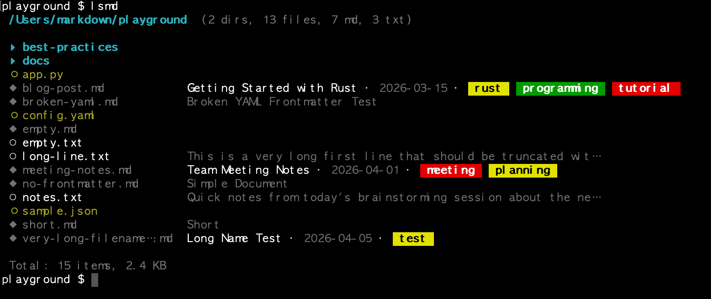
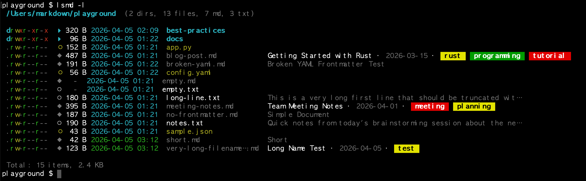
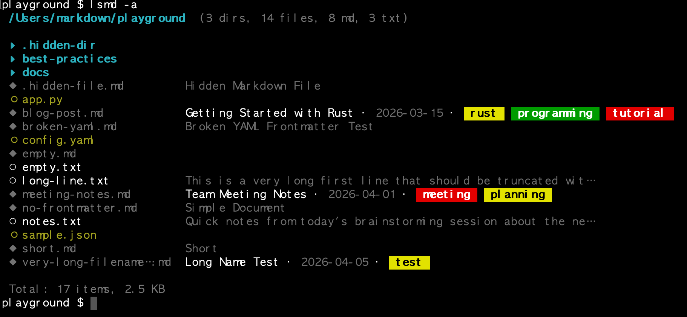
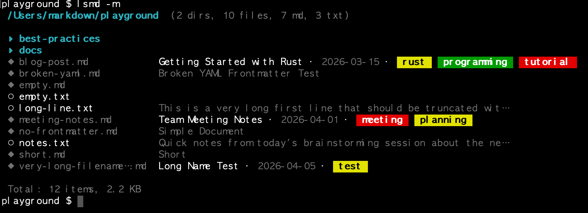
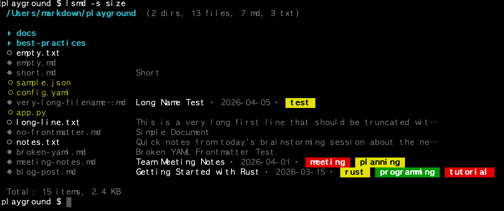

<p align="center">
  
</p>

# lsmd — **L**ist **M**ark**d**own

[](https://github.com/leaf-kit/ls.md/releases/latest)
[](LICENSE)
[](https://www.rust-lang.org/)
[](https://github.com/leaf-kit/ls.md/stargazers)
[](https://github.com/leaf-kit/ls.md/network/members)
[](https://github.com/leaf-kit/ls.md/releases)
[](https://github.com/leaf-kit/homebrew-lsmd)
[](https://github.com/leaf-kit/homebrew-lsmd)

Production-ready, structure-aware directory listing for Markdown-heavy workflows.

> **v0.2.1 Released** — [GitHub Release](https://github.com/leaf-kit/ls.md/releases/tag/v0.2.1) | [Homebrew Tap](https://github.com/leaf-kit/homebrew-lsmd)
>
> ```bash
> brew tap leaf-kit/lsmd && brew install lsmd
> ```

**lsmd** is a drop-in companion to `ls`, purpose-built for developers, technical writers, and PKM practitioners who work with Markdown daily. It parses YAML frontmatter, extracts headings, previews text files, and renders colored tag badges — all inline, in a single command. Designed for real-world document collections from dozens to thousands of files.

Built with Rust for speed and safety. Optimized with LTO. Zero runtime dependencies. Ships as a single static binary.

---

## Why lsmd? 🤔

### The Problem

With `ls`, all you see is a list of file names:

```
% ls
api-design.md    debugging-checklist.txt  markdown-style.md     quick-reference.txt
cli-ux-tips.md   git-workflow.md          project-kickoff.md    rust-error-handling.md
```

> What tags does `api-design.md` have? When was `project-kickoff.md` written?
> What is `quick-reference.txt` about? **You have to open each file to find out.**

### The Solution 💡

**lsmd** reads the content and shows you the answers — without opening a single file:

<p align="center">
  
</p>

> **`.md` files** → $\color{green}{\textsf{title}}$ · $\color{gray}{\textsf{date}}$ · `colored tag badges`
>
> **`.txt` files** → $\color{gray}{\textsf{first line preview (dimmed, 60 char max)}}$
>
> **Directories** → $\color{dodgerblue}{\textsf{▸ bright blue bold, always first}}$

Now you can see at a glance: what each document is about, when it was written, and what topics it covers — all from a single command.

### Built for PKM (Personal Knowledge Management) 🧠

If you manage a personal knowledge base with tools like **Obsidian**, **Logseq**, **Dendron**, or plain markdown files, **lsmd** is your terminal companion:

- 🗂️ **Navigate your vault from the terminal** — see titles, dates, and tags without launching a GUI
- 🔍 **Find notes by tag** — pipe to `grep` to instantly locate all notes tagged `#rust` or `#meeting`
- 👀 **Scan before you open** — know what's inside 100 files without opening any of them
- ✅ **Review at a glance** — quickly check if your notes have proper frontmatter and tags
- 🔗 **Combine with Unix tools** — `grep`, `awk`, `sort` for powerful ad-hoc queries across your knowledge base

Trusted by developers and writers who manage documentation repositories, Zettelkasten vaults, and engineering knowledge bases from the terminal.

> *Don't just list files. List meaning.*

---

## Features ✨

| Category | Feature |
|----------|---------|
| 📋 **Content** | YAML frontmatter parsing (title · date · tags) |
| 🏷️ **Tags** | Hash-based colored tag badges (same tag = same color) |
| 📝 **Fallback** | H1 heading → first body line → nothing (graceful) |
| 📄 **Text** | `.txt` first-line preview (sanitized, 60 char truncation) |
| 🎨 **Colors** | ANSI-256 TrueColor palette (DodgerBlue dirs, green .md, warm white .txt) |
| 📐 **Alignment** | 22-char name column with `…` truncation preserving extension |
| 📊 **Header** | Directory path + summary counts (dirs, files, md, txt) |
| 🔒 **Permissions** | Colored `rwx` display: $\color{green}{\textsf{r}}$$\color{goldenrod}{\textsf{w}}$$\color{darkred}{\textsf{x}}$ |
| 🌈 **Size** | $\color{wheat}{\textsf{< 1 MB}}$ · $\color{lightsalmon}{\textsf{< 1 GB}}$ · $\color{orange}{\textsf{≥ 1 GB}}$ |
| 📅 **Date** | $\color{green}{\textsf{< 1 hr}}$ · $\color{springgreen}{\textsf{< 1 day}}$ · $\color{darkcyan}{\textsf{older}}$ |
| 📁 **Sorting** | Directories first; by name, size, modified, type |
| 🔤 **Title mode** | `-t` shows only first `#` heading |
| 📂 **Filter** | `-m` for .md/.txt only, `-a` for hidden files |
| ⚡ **Performance** | Rust + LTO, single binary, zero dependencies |

---

## Installation 📦

### Homebrew (macOS)

```bash
brew tap leaf-kit/lsmd
brew install lsmd
```

### Build from Source

```bash
git clone https://github.com/leaf-kit/ls.md.git
cd ls.md
cargo build --release
cp target/release/lsmd /usr/local/bin/
```

Or use the interactive build script (runs tests before release):

```bash
./build.sh
```

## Update

| Method | Command |
|--------|---------|
| Homebrew | `brew upgrade lsmd` |
| Source | `git pull && cargo build --release && cp target/release/lsmd /usr/local/bin/` |

## Uninstall

| Method | Command |
|--------|---------|
| Homebrew | `brew uninstall lsmd && brew untap leaf-kit/lsmd` |
| Manual | `rm /usr/local/bin/lsmd` |

---

## Commands & Output Examples 📸

All examples are actual outputs from the included `playground/` directory.

### 1. Default Listing — `lsmd`

<p align="center">
  
</p>

<details>
<summary>📋 Text output (click to expand)</summary>

```
% lsmd playground
 /path/to/playground  (2 dirs, 13 files, 7 md, 3 txt)

 ▸ best-practices
 ▸ docs
 ◦ app.py
 ◆ blog-post.md            Getting Started with Rust · 2026-03-15 ·  rust   programming   tutorial
 ◆ broken-yaml.md          Broken YAML Frontmatter Test
 ◦ config.yaml
 ◆ empty.md
 ○ empty.txt
 ○ long-line.txt           This is a very long first line that should be truncated wit…
 ◆ meeting-notes.md        Team Meeting Notes · 2026-04-01 ·  meeting   planning
 ◆ no-frontmatter.md       Simple Document
 ○ notes.txt               Quick notes from today's brainstorming session about the ne…
 ◦ sample.json
 ◆ short.md                Short
 ◆ very-long-filename….md  Long Name Test · 2026-04-05 ·  test

 Total: 15 items, 2.4 KB
```

</details>

> **Legend:** `▸` directory · `◆` markdown · `○` text · `◦` other

### 2. Long Format — `lsmd -l`

<p align="center">
  
</p>

<details>
<summary>📋 Text output (click to expand)</summary>

```
% lsmd playground -l
 /path/to/playground  (2 dirs, 13 files, 7 md, 3 txt)

 drwxr-xr-x  ▸ 320 B 2026-04-05 02:09  best-practices
 drwxr-xr-x  ▸  96 B 2026-04-05 01:22  docs
 .rw-r--r--  ◦ 152 B 2026-04-05 01:21  app.py
 .rw-r--r--  ◆ 487 B 2026-04-05 01:21  blog-post.md            Getting Started with Rust · 2026-03-15
 .rw-r--r--  ◆ 191 B 2026-04-05 01:22  broken-yaml.md          Broken YAML Frontmatter Test
 .rw-r--r--  ◦  56 B 2026-04-05 01:22  config.yaml
 .rw-r--r--  ◆   -  2026-04-05 01:21  empty.md
 .rw-r--r--  ○   -  2026-04-05 01:21  empty.txt
 .rw-r--r--  ○ 180 B 2026-04-05 01:21  long-line.txt           This is a very long first line…
 .rw-r--r--  ◆ 395 B 2026-04-05 01:21  meeting-notes.md        Team Meeting Notes · 2026-04-01
 .rw-r--r--  ◆ 187 B 2026-04-05 01:21  no-frontmatter.md       Simple Document
 .rw-r--r--  ○ 190 B 2026-04-05 01:21  notes.txt               Quick notes from today's brainstorming…
 .rw-r--r--  ◦  43 B 2026-04-05 01:21  sample.json

 Total: 15 items, 2.4 KB
```

</details>

> Shows **permissions** · **icon** · **size** (color by magnitude) · **date** (color by recency) · **name** · **metadata**

### 3. Show Hidden Files — `lsmd -a`

<p align="center">
  
</p>

<details>
<summary>📋 Text output (click to expand)</summary>

```
% lsmd playground -a
 /path/to/playground  (3 dirs, 14 files, 8 md, 3 txt)

 ▸ .hidden-dir
 ▸ best-practices
 ▸ docs
 ◆ .hidden-file.md         Hidden Markdown File
 ◦ app.py
 ◆ blog-post.md            Getting Started with Rust · 2026-03-15 ·  rust   programming   tutorial
 ◆ broken-yaml.md          Broken YAML Frontmatter Test
 ...

 Total: 17 items, 2.5 KB
```

</details>

### 4. Markdown Only — `lsmd -m`

<p align="center">
  
</p>

<details>
<summary>📋 Text output (click to expand)</summary>

```
% lsmd playground -m
 /path/to/playground  (2 dirs, 10 files, 7 md, 3 txt)

 ▸ best-practices
 ▸ docs
 ◆ blog-post.md            Getting Started with Rust · 2026-03-15 ·  rust   programming   tutorial
 ◆ broken-yaml.md          Broken YAML Frontmatter Test
 ◆ empty.md
 ○ empty.txt
 ○ long-line.txt           This is a very long first line that should be truncated wit…
 ◆ meeting-notes.md        Team Meeting Notes · 2026-04-01 ·  meeting   planning
 ◆ no-frontmatter.md       Simple Document
 ○ notes.txt               Quick notes from today's brainstorming session about the ne…
 ◆ short.md                Short
 ◆ very-long-filename….md  Long Name Test · 2026-04-05 ·  test

 Total: 12 items, 2.2 KB
```

</details>

> Filters to `.md` and `.txt` only. Directories are always included.

### 5. Sort by Size — `lsmd -s size`

<p align="center">
  
</p>

<details>
<summary>📋 Text output (click to expand)</summary>

```
% lsmd playground -s size
 /path/to/playground  (2 dirs, 13 files, 7 md, 3 txt)

 ▸ docs
 ▸ best-practices
 ○ empty.txt
 ◆ empty.md
 ◆ short.md                Short
 ◦ sample.json
 ◦ config.yaml
 ◆ very-long-filename….md  Long Name Test · 2026-04-05 ·  test
 ◦ app.py
 ○ long-line.txt           This is a very long first line that should be truncated wit…
 ◆ no-frontmatter.md       Simple Document
 ○ notes.txt               Quick notes from today's brainstorming session about the ne…
 ◆ broken-yaml.md          Broken YAML Frontmatter Test
 ◆ meeting-notes.md        Team Meeting Notes · 2026-04-01 ·  meeting   planning
 ◆ blog-post.md            Getting Started with Rust · 2026-03-15 ·  rust   programming   tutorial

 Total: 15 items, 2.4 KB
```

</details>

### 6. Title Only — `lsmd -t`

Show only the first `#` heading from `.md` files, without frontmatter details:

```
% lsmd playground/best-practices -t
 /path/to/playground/best-practices  (8 files, 6 md, 2 txt)

 ◆ api-design.md           RESTful API Design Principles
 ◆ cli-ux-tips.md          CLI UX Design Tips
 ○ debugging-checkli….txt  Step-by-step debugging checklist for production incidents
 ◆ git-workflow.md         Git Workflow Guide
 ◆ markdown-style.md       Markdown Writing Style Guide
 ◆ project-kickoff.md      Project Kickoff Checklist
 ○ quick-reference.txt     Common terminal shortcuts and commands for daily developmen…
 ◆ rust-error-handling.md  Rust Error Handling Patterns

 Total: 8 items, 5.0 KB
```

> Clean title scan — perfect for large vaults. Combine with `-l` for sizes and dates.

### 7. Best Practices — Curated Examples

```
% lsmd playground/best-practices
 /path/to/playground/best-practices  (8 files, 6 md, 2 txt)

 ◆ api-design.md           RESTful API Design Principles · 2026-03-15 ·  api   rest   design
 ◆ cli-ux-tips.md          CLI UX Design Tips · 2026-04-03 ·  cli   ux   design
 ○ debugging-checkli….txt  Step-by-step debugging checklist for production incidents
 ◆ git-workflow.md         Git Workflow Guide · 2026-03-20 ·  git   workflow   collaboration
 ◆ markdown-style.md       Markdown Writing Style Guide · 2026-03-10 ·  markdown   writing   documentation
 ◆ project-kickoff.md      Project Kickoff Checklist · 2026-04-01 ·  project   checklist   onboarding
 ○ quick-reference.txt     Common terminal shortcuts and commands for daily developmen…
 ◆ rust-error-handling.md  Rust Error Handling Patterns · 2026-03-28 ·  rust   error-handling   patterns

 Total: 8 items, 5.0 KB
```

---

## Options Reference ⚙️

| Option | Short | Description |
|--------|-------|-------------|
| `--all` | `-a` | Show hidden files (dotfiles) |
| `--long` | `-l` | Long format: permissions, size, date, metadata |
| `--no-color` | | Disable ANSI color output |
| `--sort <FIELD>` | `-s` | Sort by: `name`, `size`, `modified`, `type` |
| `--reverse` | `-r` | Reverse sort order |
| `--md-only` | `-m` | Show only `.md` and `.txt` files |
| `--title` | `-t` | Show only the first `#` heading for `.md` files |

---

## Color Scheme 🎨

lsmd uses an ANSI-256 TrueColor palette for consistent, readable output across terminals:

### File Types

| Element | Color | Example |
|---------|-------|---------|
| Directory name | $\color{dodgerblue}{\textsf{DodgerBlue bold}}$ | `▸ best-practices` |
| `.md` file name | $\color{green}{\textsf{Light Green}}$ | `◆ blog-post.md` |
| `.txt` file name | $\color{wheat}{\textsf{Warm White}}$ | `○ notes.txt` |
| Other file name | $\color{goldenrod}{\textsf{Yellow}}$ | `◦ app.py` |
| Hidden file | $\color{gray}{\textsf{Grey}}$ | `◆ .hidden-file.md` |
| Executable | $\color{limegreen}{\textsf{Green bold}}$ | `◦ script.sh` |

### Long Format Columns

| Column | Coloring |
|--------|----------|
| Permission `r` | $\color{green}{\textsf{green}}$ |
| Permission `w` | $\color{goldenrod}{\textsf{yellow}}$ |
| Permission `x` | $\color{darkred}{\textsf{red}}$ |
| Permission `-` / `.` | $\color{gray}{\textsf{grey}}$ |
| Size < 1 MB | $\color{wheat}{\textsf{Wheat}}$ |
| Size < 1 GB | $\color{lightsalmon}{\textsf{LightSalmon}}$ |
| Size ≥ 1 GB | $\color{orange}{\textsf{Orange}}$ |
| Date < 1 hour | $\color{limegreen}{\textsf{Green}}$ |
| Date < 1 day | $\color{springgreen}{\textsf{SpringGreen}}$ |
| Date older | $\color{darkcyan}{\textsf{DarkCyan}}$ |

---

## Content Preview Policy 📖

lsmd extracts a one-line summary from `.md` and `.txt` files. Preview text is **sanitized** — special characters are stripped, keeping only readable text (alphanumeric, Korean, CJK, basic punctuation).

### `.md` preview priority

| Priority | Source | Displayed as |
|----------|--------|-------------|
| 1 | YAML frontmatter | `title` · `date` · colored tag badges |
| 2 | First `# H1` heading | dimmed heading text |
| 3 | First body line | dimmed content (skipping code fences, `---`) |
| 4 | Broken YAML | falls back to #2 or #3 |
| 5 | Empty file | file name only |

### `.txt` preview

| Priority | Source | Displayed as |
|----------|--------|-------------|
| 1 | First meaningful line | dimmed, sanitized, max 60 chars + `…` |
| 2 | Empty file | file name only |

---

## Pipe Integration (`|`) 🔧

lsmd auto-disables ANSI colors when output is piped, making it safe for `grep`, `awk`, `wc`, `sort`, `sed`, `xargs`.

### Useful Pipe Recipes

```bash
# Find files by tag
lsmd playground/best-practices | grep "rust"

# Find all documents tagged "design"
lsmd playground/best-practices | grep "design"

# Count markdown files
lsmd playground/best-practices | grep "\.md" | wc -l

# Extract file names only
lsmd playground/best-practices | awk '{print $1}'

# Extract document titles
lsmd playground/best-practices | grep "·" | cut -d'·' -f1 | sed 's/^[[:space:]]*[^ ]* *//'

# Tag frequency analysis
lsmd playground/best-practices | grep "·" | sed 's/.*·//' | grep -oE '[a-z][-a-z]*' | sort | uniq -c | sort -rn

# Line count per file
lsmd playground/best-practices | awk '{print $1}' | sed 's|^|playground/best-practices/|' | xargs wc -l
```

> **Notes:** Colors auto-disable in pipes. File names are the first field. Frontmatter fields are separated by `·`. Output is UTF-8.

---

## Playground 🎮

The repository includes a `playground/` directory with sample files for testing every feature:

```
playground/
├── best-practices/          # Curated .md with rich frontmatter & tags
│   ├── api-design.md        # tags: api, rest, design
│   ├── cli-ux-tips.md       # tags: cli, ux, design
│   ├── git-workflow.md      # tags: git, workflow, collaboration
│   ├── markdown-style.md    # tags: markdown, writing, documentation
│   ├── project-kickoff.md   # tags: project, checklist, onboarding
│   ├── rust-error-handling.md
│   ├── debugging-checklist.txt
│   └── quick-reference.txt
├── docs/guide.md
├── blog-post.md             # frontmatter: title + date + tags
├── meeting-notes.md         # frontmatter: title + date + tags
├── no-frontmatter.md        # H1 heading only (fallback test)
├── broken-yaml.md           # broken YAML (error handling test)
├── empty.md / empty.txt     # edge case: empty files
├── notes.txt / long-line.txt
├── app.py / config.yaml / sample.json
└── short.md / very-long-filename-example.md
```

---

## Edge Cases 🛡️

| Scenario | Behavior |
|----------|----------|
| Empty file | Name only, no crash |
| Broken YAML frontmatter | Falls back to H1 or body text |
| Very long file names | Truncated with `…`, extension preserved |
| Non-existent path | Clear error message |
| Permission errors | Skipped silently |
| Non-directory path | Clear error message |

---

## Related Projects 🔗

| Project | Description | Difference |
|---------|-------------|------------|
| [**gmd**](https://github.com/leaf-kit/g.md) | Grep Markdown — structure-aware search | Search vs listing |
| [**lsd**](https://github.com/lsd-rs/lsd) | LSDeluxe — modern `ls` with icons | File-type aware, not content-aware |
| [**eza**](https://github.com/eza-community/eza) | Modern `ls` replacement | Metadata-focused, not Markdown-aware |

> lsmd is the only `ls`-style tool that **reads inside** `.md` and `.txt` files to surface structured metadata inline.

---

## Feedback & Contributing 💬

Contributions, issues, and feature requests are welcome. If lsmd is useful in your workflow, consider starring the repo — it helps others discover the project.

[github.com/leaf-kit/ls.md/issues](https://github.com/leaf-kit/ls.md/issues)

## License

[MIT](LICENSE)
